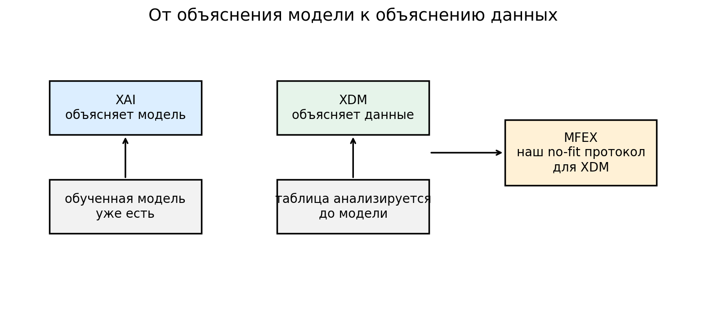
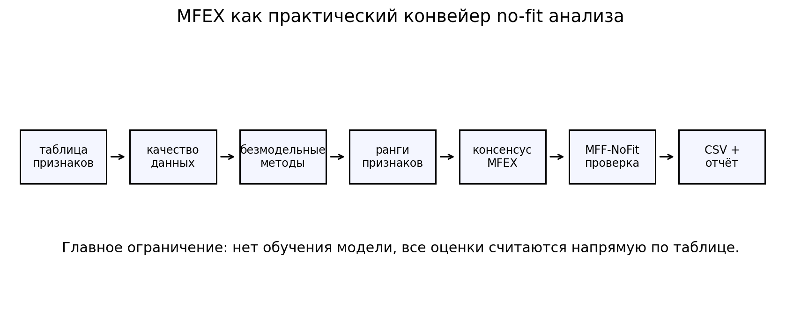
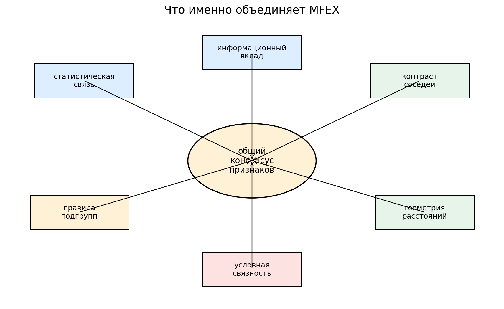
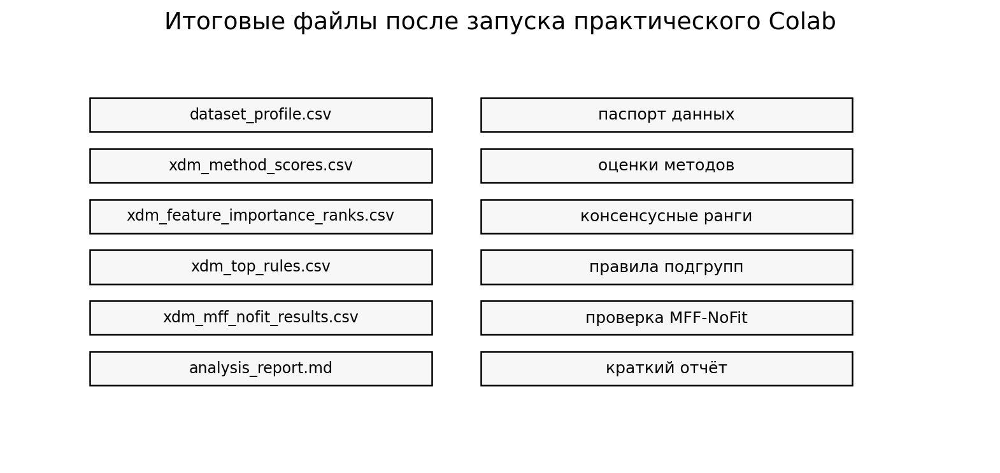

# XDM/MFEX

**XDM** — это объяснимый анализ данных.  
Он нужен, чтобы понять структуру табличного набора данных **до построения модели**.

**MFEX** — наш безмодельный протокол для XDM.  
Он собирает несколько способов оценки признаков в один понятный конвейер: от таблицы до рангов признаков, правил и проверки устойчивости.

---

## Зачем это нужно

Обычная объяснимость часто работает после обучения модели.  
Сначала строится модель, потом её объясняют через SHAP, LIME или похожие методы.

В XDM логика другая:

- сначала анализируется сама таблица;
- затем выделяются признаки, которые устойчиво связаны с целевой переменной;
- потом проверяется, не является ли этот набор признаков случайным;
- только после этого можно переходить к моделям, если они вообще нужны.

<p align="center">
  
</p>

<p align="center"><b>Рис. 1. XAI объясняет модель, XDM объясняет данные.</b></p>

---

## Что делает MFEX

MFEX не является классификатором и не обучает модель.  
Это исследовательский протокол для объяснимого анализа таблиц.

<p align="center">
  
</p>

<p align="center"><b>Рис. 2. Общая схема MFEX.</b></p>

MFEX проходит несколько шагов:

1. загружает таблицу;
2. проверяет качество данных;
3. считает безмодельные оценки признаков;
4. переводит оценки в ранги;
5. собирает консенсусный список признаков;
6. проверяет его через MFF-NoFit;
7. сохраняет итоговые таблицы и отчёт.

---

## Какие методы используются

MFEX объединяет несколько разных взглядов на данные.  
Один метод не считается «истиной». Каждый метод показывает свою сторону структуры таблицы.

<p align="center">
  
</p>

<p align="center"><b>Рис. 3. Основные группы методов в MFEX.</b></p>

### Статистическая связь

Показывает, насколько значения признака различаются между классами целевой переменной.

### Информационный вклад

Показывает, уменьшает ли признак неопределённость относительно цели.

### Контраст соседей

Проверяет, помогает ли признак различать близкие объекты разных классов.

### Геометрия расстояний

Показывает, помогает ли признак разделять классы в пространстве признаков.

### Условная связность

Проверяет, сохраняет ли признак связь с целью на фоне остальных признаков.

### Правила подгрупп

Ищет простые интервальные правила, которые можно объяснить словами.

---

## Что такое консенсус признаков

Разные методы дают разные оценки.  
MFEX переводит оценки в ранги и собирает общий список признаков.

Важным считается не тот признак, который победил в одном методе, а тот, который стабильно высоко стоит в нескольких разных методах.

Для каждого признака считаются:

- медианный ранг;
- средний ранг;
- разброс рангов;
- флаг устойчивости;
- избыточность относительно других признаков.

---

## Что такое MFF-NoFit

**MFF-NoFit** — проверка без обучения модели.

Она отвечает на вопрос:

> выбранные признаки действительно сохраняют целевую структуру лучше случайных признаков?

Если MFF-NoFit положительный, значит консенсусный набор признаков лучше случайного набора той же мощности.

---

## Где это применять

MFEX подходит для табличных данных, где нужно понять признаки до модели:

- медицина;
- экономика;
- ESG;
- социальные данные;
- кредитный риск;
- научные таблицы;
- учебные и исследовательские наборы данных.

---

## Два Colab

В репозитории достаточно двух блокнотов.

| Файл | Назначение |
|---|---|
| `01_XDM_Methods_Expanded_Theory.ipynb` | Теория: что такое XDM, какие есть безмодельные методы и как они собираются в MFEX. |
| `02_XDM_Practice_Expanded_NoFit.ipynb` | Практика: выбор данных, запуск анализа, получение таблиц и отчёта. |

---

## Как запустить практику

В практическом Colab нужно выбрать режим данных:

```python
DATA_MODE = "medical_demo"      # medical_demo, economic_demo, csv
ANALYSIS_PROFILE = "full"       # quick, full, extended
```

Если используется свой CSV:

```python
DATA_MODE = "csv"
CSV_PATH = "your_dataset.csv"
TARGET_COLUMN = "target"
```

После этого нужно запустить все ячейки.

---

## Итоговые файлы

<p align="center">
  
</p>

<p align="center"><b>Рис. 4. Файлы, которые создаёт практический блокнот.</b></p>

После запуска создаются:

| Файл | Содержание |
|---|---|
| `dataset_profile.csv` | краткое описание набора данных |
| `xdm_method_scores.csv` | оценки признаков по методам |
| `xdm_feature_importance_ranks.csv` | общий консенсусный рейтинг признаков |
| `xdm_top_rules.csv` | лучшие правила подгрупп |
| `xdm_mff_nofit_results.csv` | проверка MFF-NoFit |
| `analysis_report.md` | краткий аналитический отчёт |

---

## Главное ограничение

MFEX не ставит диагноз, не принимает управленческое решение и не доказывает причинность.

Он показывает структуру таблицы:

- какие признаки выглядят важными;
- какие признаки устойчивы;
- какие признаки повторяют друг друга;
- какие правила можно сформулировать;
- лучше ли выбранные признаки случайного набора.

---

## Методологическая позиция

MFEX — это не модель.  
MFEX — это no-fit протокол объяснимого анализа данных.

Его задача — дать исследователю понятную карту признаков до построения предсказательной модели.
